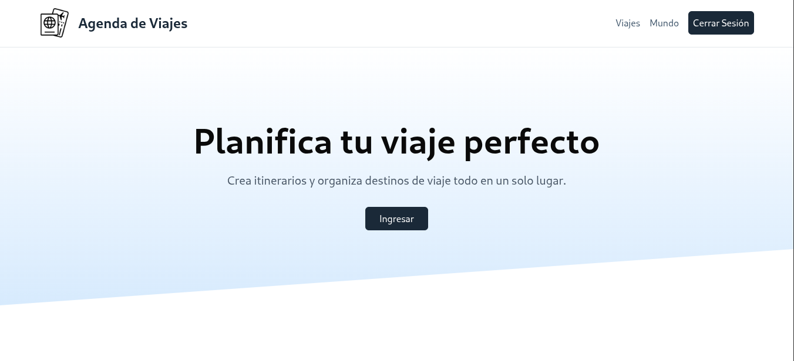
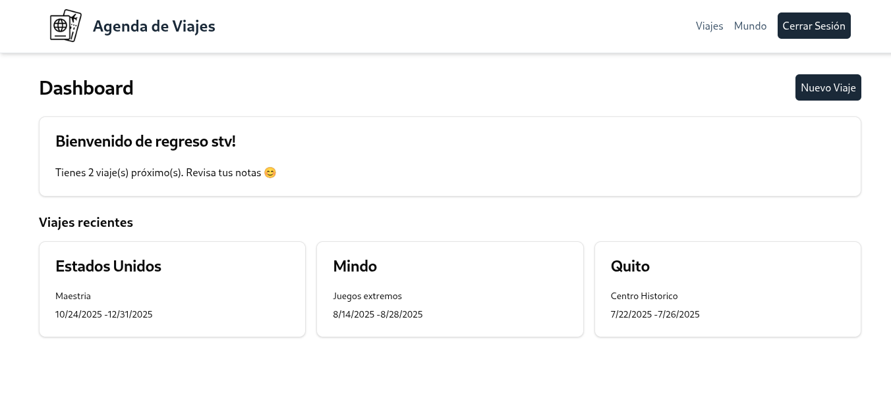
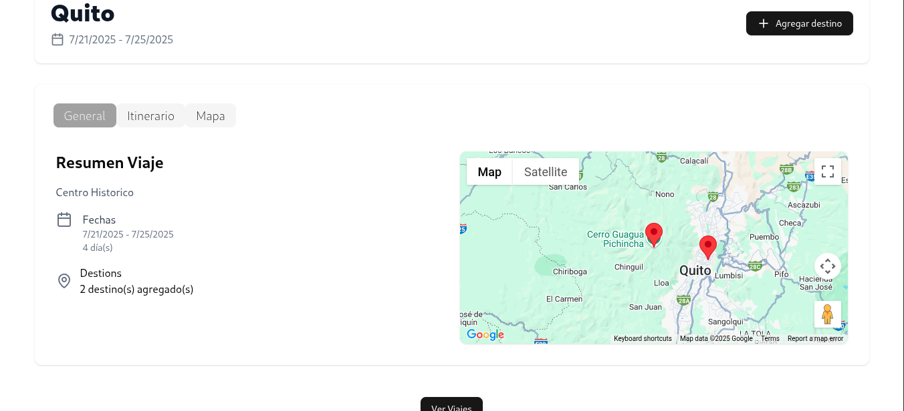
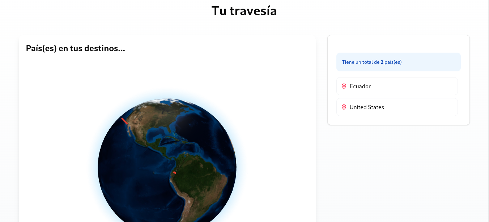

# 🌍 Travel Planner

A modern travel planning web application built with **Next.js**, **TypeScript**, and **Prisma**, **PostgreSQL** allowing users to log and visualize their trips around the world.

## ✨ Live Demo

Experience the application live!
[**Visit Travel Planner **](https://travel-planner-gamma-green.vercel.app/)

## 📸 Screenshots

Here are some glimpses of the application in action:

### Landing Page

Get started by planning your perfect trip.


### Dashboard

Your personalized dashboard showing recent trips and greetings.


### Trip Details

Detailed view of a specific trip, including a map of destinations.


### Global Overview

Visualize all your visited countries on an interactive 3D globe.


---

## 🚀 Features

- 🌐 Interactive 3D globe to show visited countries
- 🗺️ Store and manage trip locations
- 🧠 Built using modern tools: Next.js App Router, Prisma, TailwindCSS, PostgreSQL database hosted on Supabase
- 🔒 Secure authentication
- ☁️ API-based trip management

## 🛠️ Tech Stack

- **Frontend**: Next.js 14, React, TypeScript, TailwindCSS
- **Backend**: Node.js, Prisma
- **Database**: PostgreSQL managed through Prisma ORM
- **Deployment**: Vercel
- **Other Tools**: react-globe.gl, Lucide icons

## 📦 Getting Started

```bash
git clone [https://github.com/stvdn/travel_planner.git](https://github.com/stvdn/travel_planner.git)
cd travel_planner
npm install
mv envexample.txt .env
#NOTE: update .env values
npx prisma generate
npx prisma db push
npm run dev
```
